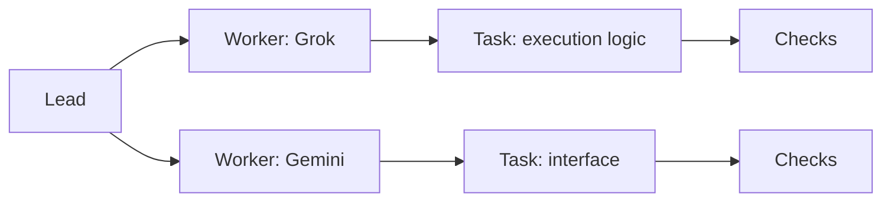

# Dark theme and live work map

Implemented in main on 2026-10-08: Light, Dark and System themes, plus a
read-only work map with exact task selection, filters, history and bounded
pagination. These additions are source changes for v0.5.4; published v0.5.3
contains the earlier browser. See the [browser guide](../../bridge/README.md).
Recoverable continuation is the next delivery task. The design below also
records later ideas; lead identity and dependency edges remain future work.

## Next map improvement — interactive viewport

Requested on 2026-10-08, after the current manual work-saving task: let people
zoom in and out and pan across the map. Arrange the observed Project hub,
workers and their tasks radially, branching from the centre toward the edges.
These controls and the radial layout are planned, not yet implemented.

Provide visible zoom, Fit view and Reset controls, pointer dragging and usable
touch and keyboard alternatives. Keep the chosen viewport, selected task and
keyboard focus stable as observations refresh. Preserve readable labels,
bounded pagination and the list view for larger projects. Connections still
represent recorded ownership; positioning must not imply invented delegation
or dependencies. This is a presentation change with no additional AI calls
or backend permissions.

## Dark theme

Provide Light, Dark and System choices in the workspace header or settings.
Follow the operating system initially and remember an explicit choice in the
browser. Apply it across the workspace, forms, output, files and work map.

Use dark neutral surfaces, readable text and restrained state colors. Keep
focus outlines clear, and distinguish states with words and icons as well
as color. Preserve the existing layout and behavior when changing themes.
Theme selection is local presentation and needs no AI call.

## A map of the work

Offer a Work map beside the existing list view. Show who owns each task and
what stage the work has reached. Files and branches belong in a selected
node's detail panel rather than in the initial graph.

An illustrative future view, not an observation of a running team:

Connections must say what they mean: task ownership, delegation, dependency
or review. Draw a connection only when recorded evidence supports that
relationship. The current activity endpoint supplies worker/task ownership
and process, validation and review observations. It does not supply a lead
identity or a complete dependency graph. Start with a Project hub when lead
data is unavailable; add lead and dependency connections when supported.

## Keep large projects readable

- Start with active work and tasks needing attention. Group completed work
  under expandable history; show how many records a group contains.
- Group tasks by worker. Keep each worker's current attempt separate from
  its earlier attempts and historical results.
- Offer search and filters for worker and task state. Expanding a group or
  focusing a task should reveal its immediate connections first.
- Keep a bounded number of expanded nodes, with a visible count and an
  explicit way to reveal more. Choose the initial bound during UI work.
- Preserve node positions and the selected task while observations update.
  Avoid moving the whole graph on every refresh. Offer Fit view and Reset.
- Keep the list view available, including on small screens and for keyboard
  navigation. Nodes need readable labels, not just provider logos.

Selecting a node opens its task, latest recorded update and evidence. Link
to protected Source output and tracked files when those capabilities and
worker grants are enabled. Display missing capabilities plainly. Selecting
a node observes work; starting, stopping or accepting work remains an
explicit action in the existing workflow.

## Live means observed

Reuse the current activity polling first: the shipped page refreshes every
two seconds. Show the observation time and update the affected nodes rather
than reconstructing the layout. On failure, mark the view unavailable and
remove current-state claims; an old graph must not look live.

Use the actual process, validation and review states independently. A held
worker lock or old running record does not prove an AI is currently making
progress. Preserve Unknown and interrupted completion. Do not infer overall
acceptance from a successful process exit or a recorded reviewer approval.

Use a small state transition to make genuine updates visible, respecting
reduced motion. Do not animate fabricated work, invent percentages, estimate
quota from node activity or call an AI to summarize every refresh. Existing
protected output excerpts can provide short updates where enabled.

## Delivery

The accepted implementation uses existing observed ownership and states;
no backend endpoint or AI call was added. It shows at most 24 task nodes per
page and keeps tasks needing attention visible. Finished means process
success, passed validation and approved review; this is recorded evidence,
not a substitute for a fresh native readiness check.

Focused server and Chromium checks passed, including theme persistence,
exact identity and focus during polling, grouped history, keyboard access,
console grants, failure/recovery and mobile overflow. Personal lead review
and screenshot inspection completed before integration. The full repository
gate remains required for the completed v0.5.4 release. Add richer delegation
and dependency data separately when the engine records those relationships.
