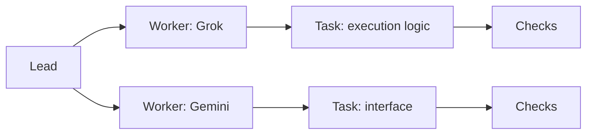

# Dark theme and live work map

Implemented in main on 2026-10-08: Light, Dark and System themes, plus a
read-only work map with exact task selection, filters, history and bounded
pagination. These additions are source changes for v0.5.4; published v0.5.3
contains the earlier browser. See the [browser guide](../../bridge/README.md).
Recoverable continuation is the next delivery task. The design below also
records later ideas; lead identity and dependency edges remain future work.

## Interactive viewport

Implemented in source after the 2026-10-08 manual work-saving task: a bounded
responsive SVG canvas, visible zoom buttons and percentage, Fit view and
Reset 100%. Recorded workers branch radially from the centred Project hub;
their owned tasks grow outward within each branch. Connections still represent
recorded ownership, without inventing delegation or dependencies.

Drag with a mouse or one finger to pan. Ctrl/Command plus wheel zooms around
the pointer; ordinary wheel keeps page scrolling. Keyboard controls are
arrow keys to pan, +/− to zoom, 0 to fit and Home to reset. Tab reaches nodes,
revealing an offscreen node; Enter/Space selects its exact task. The camera
supports 5–300% scale. Fit follows the visible page and window dimensions;
a manually chosen camera stays fixed across polls, view switches and resizing.
Pinch zoom remains future work.

The SVG retains exact-key groups and focus while observations refresh, with
deterministic positions for unchanged topology. Up to 24 tasks per page,
filters, search and List view keep large projects navigable. These presentation
changes add no AI calls or backend permissions. They are source for the next
v0.5.4 release; the published release remains v0.5.3.

## Dark theme

Provide Light, Dark and System choices in the workspace header or settings.
Follow the operating system initially and remember an explicit choice in the
browser. Apply it across the workspace, forms, output, files and work map.

Use black, white, charcoal and neutral gray surfaces and readable text. Keep
focus outlines clear and distinguish states with explicit words and borders. Preserve the existing layout and behavior when changing themes.
Theme selection is local presentation and needs no AI call.

## A map of the work

Offer a Work map beside the existing list view. Show who owns each task and
what stage the work has reached. Files and branches belong in a selected
node's detail panel rather than in the initial graph.

An illustrative future view, not an observation of a running team:

Connections must say what they mean: task ownership, delegation, dependency
or review. Draw a connection only when recorded evidence supports that
relationship. The current activity endpoint supplies worker/task ownership
and process, validation and review observations. It does not supply a lead
identity or a complete dependency graph. Start with a Project hub when lead
data is unavailable; add lead and dependency connections when supported.

## Keep large projects readable

- Start with active work and tasks needing attention. Group completed work
  under expandable history; show how many records a group contains.
- Group tasks by worker. Keep each worker's current attempt separate from
  its earlier attempts and historical results.
- Offer search and filters for worker and task state. Expanding a group or
  focusing a task should reveal its immediate connections first.
- Keep a bounded number of expanded nodes, with a visible count and an
  explicit way to reveal more. Choose the initial bound during UI work.
- Preserve node positions and the selected task while observations update.
  Avoid moving the whole graph on every refresh. Offer Fit view and Reset.
- Keep the list view available, including on small screens and for keyboard
  navigation. Nodes need readable labels, not just provider logos.

Selecting any node opens details in the right-hand quarter of the map area
on screens at least 1100px wide. The map keeps the other three-quarters; without
a selected node it fills the available width. Smaller screens stack details below
the map. Desktop details scroll within a bounded panel, and Clear selection
closes it. Selection, focus and camera behavior still follow the map contract. Link
to protected Source output and tracked files when those capabilities and
worker grants are enabled. Worker and hub nodes show actual observed task totals,
including history, with visible-page counts labelled separately. Worker nodes can
open their granted current session; the hub has no session of its own. Missing
task evidence and unavailable capabilities get explicit explanations and disabled
gray output/files controls, rather than a blank panel or a disappearing action. Selecting
a node observes work; starting, stopping or accepting work remains an
explicit action in the existing workflow.

## Live means observed

Reuse the current activity polling first: the shipped page refreshes every
two seconds. Show the observation time and update the affected nodes rather
than reconstructing the layout. On failure, mark the view unavailable and
remove current-state claims; an old graph must not look live.

Use the actual process, validation and review states independently. A held
worker lock or old running record does not prove an AI is currently making
progress. Preserve Unknown and interrupted completion. Do not infer overall
acceptance from a successful process exit or a recorded reviewer approval.

Use a small state transition to make genuine updates visible, respecting
reduced motion. Do not animate fabricated work, invent percentages, estimate
quota from node activity or call an AI to summarize every refresh. Existing
protected output excerpts can provide short updates where enabled.

## Delivery

The accepted implementation uses existing observed ownership and states;
no backend endpoint or AI call was added. It shows at most 24 task nodes per
page and keeps tasks needing attention visible. Finished means process
success, passed validation and approved review; this is recorded evidence,
not a substitute for a fresh native readiness check.

Focused server and Chromium checks passed, including theme persistence,
exact identity and focus during polling, grouped history, keyboard access,
console grants, failure/recovery and mobile overflow. Personal lead review
and screenshot inspection completed before integration. The full repository
gate remains required for the completed v0.5.4 release. Add richer delegation
and dependency data separately when the engine records those relationships.

## Large-workspace observation follow-up

The 2026-10-08 live check found a separate observation-budget problem: a
successful installed CLI scan on the Windows-mounted workspace took 10.37
seconds, slightly beyond the browser server's default 10-second deadline.
The browser correctly showed unavailable and removed its current-state claims;
there were no JavaScript errors. The local read-only preview was restarted
with the existing Observer constructor's timeout set to 30 seconds. Confirmed
observations and new map controls then worked at 1440px and 390px with no
page overflow. The installed release and worker configuration were unchanged.

This is a local operational adjustment, not a new published CLI option or a
completed performance improvement. Track a bounded, configurable observation
budget in the normal browser launcher and measure/cache repeated workspace
scans in the performance milestone. Keep failure clearing and observation
freshness explicit; a larger budget must not turn stale data into current
state. The full source release still requires its combined quality gate.
